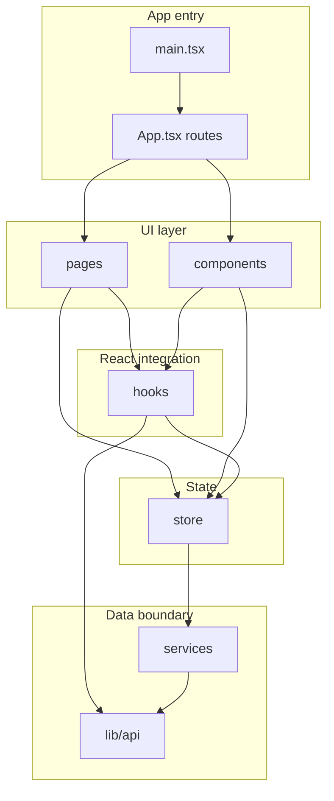

# Project Showcase — developer documentation

This folder documents how the frontend is structured and how to work in each part of [`src/`](../src/). Read [app.md](app.md) for the React entry shell, then drill into modules as needed.

## Stack

- **React** 19, **TypeScript**, **Vite** 7
- **React Router** 7 (`BrowserRouter`, nested routes under course offerings)
- **Redux Toolkit** — server-backed caches and course-scoped UI state via `createAsyncThunk` (not RTK Query)
- **Axios** — HTTP client with interceptors in [`src/lib/api.ts`](../src/lib/api.ts)
- **Firebase Auth** — sign-in sync in [`useAuth`](../src/hooks/useAuth.ts)
- **Tailwind CSS** 4, **Radix UI**, **Lucide** icons

## Scripts

From the repository root (`package.json`):

| Command           | Purpose                          |
|-------------------|----------------------------------|
| `npm run dev`     | Vite dev server with HMR         |
| `npm run build`   | Typecheck (`tsc -b`) + production build |
| `npm run preview` | Preview production build locally |
| `npm run lint`    | ESLint                           |
| `npm run test`    | Vitest (watch)                   |
| `npm run test:ci` | Vitest single run + coverage      |
| `npm run test:watch` | Same as `test` (watch mode)    |

## Path alias

Imports use `@/` → `src/` (see `tsconfig.app.json`):

```ts
import { useAppDispatch } from '@/store/hooks'
```

## Cross-cutting conventions

- **Server data** lives in Redux **slices** and is loaded via **thunks** that call **`src/services`**.
- **Ephemeral UI** (modal visibility, draft form fields, transient menus) uses **local component state**.
- **Bookmarkable identifiers** (`:offeringId`, `:teamId`) belong in the **URL** (React Router params).
- **Effective role** for a course offering is **derived** in selectors (see [store-selectors.md](store-selectors.md)), not stored as a lone field.

## Architecture



## Tests

Unit tests live under [`tests/`](../tests/) (Vitest). Current coverage skews toward `lib/` helpers, routing, enrollment utils, and `userSlice`; add tests beside the mirrored path when extending behavior (`tests/lib/`, `tests/pages/`, `tests/store/`, etc.).

## Module documentation index

| Doc | Mirrors |
|-----|---------|
| [app.md](app.md) | [`src/`](../src/) root (`main.tsx`, `App.tsx`) |
| [components.md](components.md) | [`src/components/`](../src/components/) (excluding nested below) |
| [components-ui.md](components-ui.md) | [`src/components/ui/`](../src/components/ui/) |
| [components-modals.md](components-modals.md) | [`src/components/modals/`](../src/components/modals/) |
| [hooks.md](hooks.md) | [`src/hooks/`](../src/hooks/) |
| [lib.md](lib.md) | [`src/lib/`](../src/lib/) |
| [pages.md](pages.md) | [`src/pages/`](../src/pages/) (excluding nested folders) |
| [pages-courses.md](pages-courses.md) | [`src/pages/Courses/`](../src/pages/Courses/) |
| [pages-course-settings.md](pages-course-settings.md) | [`src/pages/CourseSettings/`](../src/pages/CourseSettings/) |
| [pages-dashboard.md](pages-dashboard.md) | [`src/pages/Dashboard/`](../src/pages/Dashboard/) |
| [services.md](services.md) | [`src/services/`](../src/services/) |
| [store.md](store.md) | [`src/store/`](../src/store/) |
| [store-slices.md](store-slices.md) | [`src/store/slices/`](../src/store/slices/) |
| [store-thunks.md](store-thunks.md) | [`src/store/thunks/`](../src/store/thunks/) |
| [store-selectors.md](store-selectors.md) | [`src/store/selectors/`](../src/store/selectors/) |

**Where to start:** [app.md](app.md) (routing shell and bootstrap), then the module matching the code you are changing.

## Related docs

- [app.md](app.md) — `main.tsx`, `App.tsx`, route table overview
