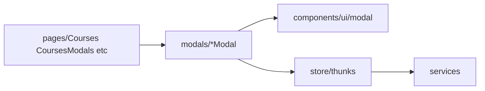

# Modals (`src/components/modals/`)

## Purpose

**Controlled dialogs** for admin/course workflows: semesters, courses, course offerings, and teams. Typical pattern props: **`isOpen`**, **`onClose`**, domain IDs (`semesterId`, `offeringId`, …), optional **`onSuccess`** callback after a successful mutation.

State for **form fields**, validation messages, and **submitting** is **local `useState`** — not Redux (aligns with Redux style guide guidance on ephemeral form state).

## Key files

| File | Responsibility |
|------|----------------|
| [`index.ts`](../src/components/modals/index.ts) | Barrel exports for all modal components + re-exports `Modal` primitives from **`ui/`** |
| **`New*` / `Edit*`** variants | CRUD dialogs dispatching Redux **thunks** on submit (and occasionally calling **`services`** directly where historical) |

## Architecture

## How to develop here

1. **Compose** from `@/components/ui/modal` (`Modal`, `ModalFooter`) for consistent headers/footers.
2. **Submit path** — `useAppDispatch` → appropriate **`createAsyncThunk`** in `store/thunks/`; keep HTTP in **services**, not in the modal.
3. **Export** the new component from [**`index.ts`**](../src/components/modals/index.ts).
4. **Loading UX** — disable buttons and show inline errors from API failures (match existing modals).

## Common tasks

- **New entity CRUD** — duplicate the shape of `NewTeamModal` / `EditTeamModal`: local form state, dispatch thunk, `onClose` on success.
- **Wire from catalog** — parent holds `useState` for which modal is open (see `CoursesModals` pattern in [pages-courses.md](pages-courses.md)).

## Related docs

- [components.md](components.md), [components-ui.md](components-ui.md)
- [store-thunks.md](store-thunks.md), [pages-courses.md](pages-courses.md)
