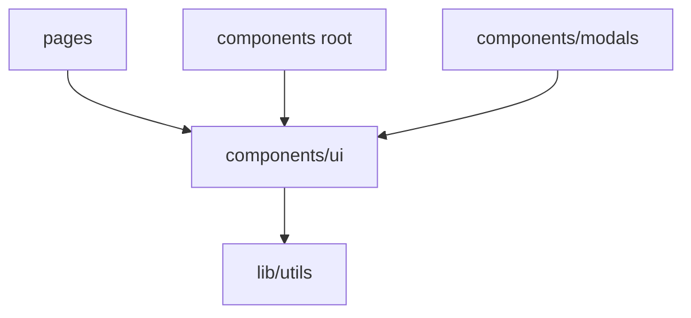

# UI primitives (`src/components/ui/`)

## Purpose

**Presentational building blocks** styled with Tailwind, **class-variance-authority** for variants, and **Radix UI** primitives where appropriate. They intentionally stay **free of Redux** and **free of domain business rules** — only layout, interaction affordances, and generic patterns (sortable table, modal shell).

## Key files

Typical contents (see repo for authoritative list):

- **`button.tsx`** — variants/sizes (`cva`)
- **`badge.tsx`**, **`card.tsx`**, **`separator.tsx`**, **`tabs.tsx`** — structural UI
- **`dropdown-menu.tsx`**, **`avatar.tsx`** — Radix-backed patterns
- **`custom-select.tsx`**, **`sortable-table.tsx`** — richer widgets
- **`modal.tsx`** — dialog shell importing local `button`; **`Modal`** and **`ModalFooter`** are reused by **`modals/`** CRUD dialogs

Dependencies are mostly **`@/lib/utils`** (`cn`) plus Radix/`lucide-react` icons from parents.

## Architecture

Consumers: **feature components**, **pages**, **`modals/`**, **`ErrorBoundary`**. Data and permissions stay **upstream**.

## How to develop here

1. **Add** a primitive when **three or more call sites** need the same markup/behavior, or when Radix wrappers need consistent styling.
2. **Naming** — follow existing `kebab-case` filenames (`sortable-table.tsx`).
3. **API style** — forward refs where Radix recommends; expose `className` and merge via `cn()` for callers.
4. **Do not** import `@/pages`, `@/store`, or **`services`** from this folder.

## Common tasks

- **New variant** — extend `buttonVariants` / similar with Tailwind tokens; verify contrast in dark/light if applicable.

## Related docs

- [components.md](components.md), [components-modals.md](components-modals.md)
