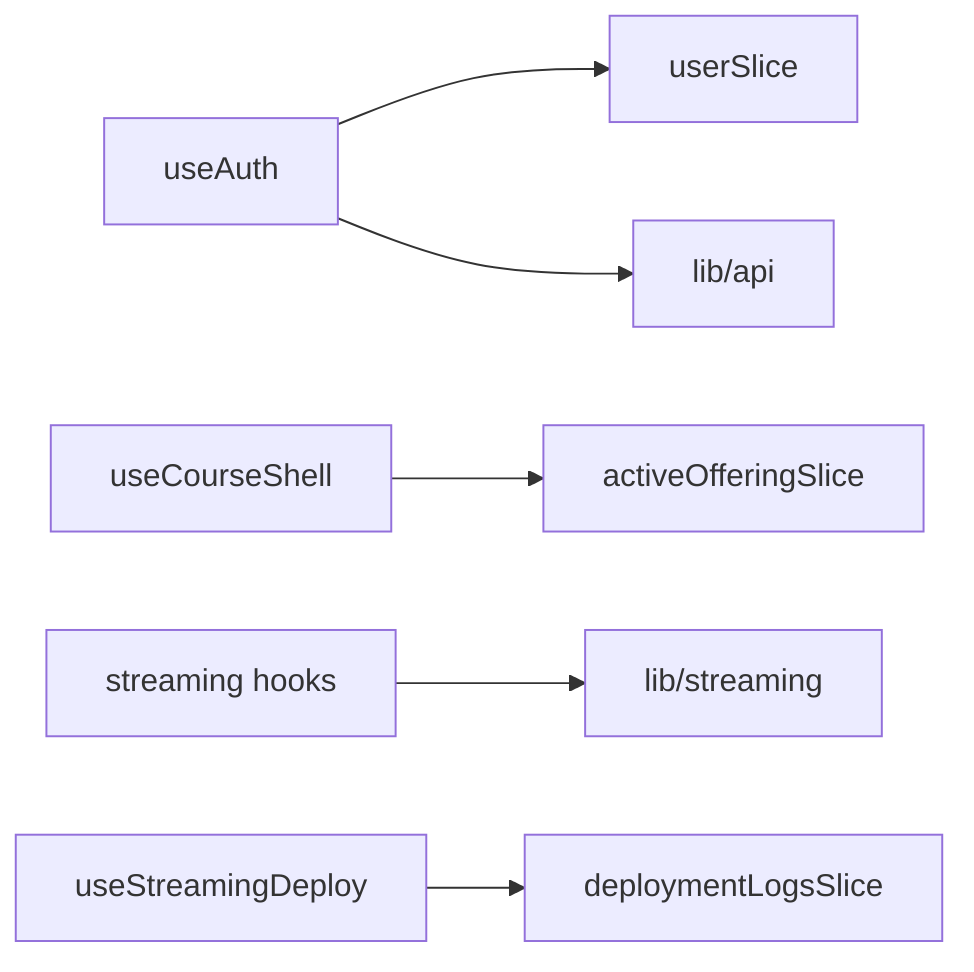

# Hooks (`src/hooks/`)

## Purpose

This layer connects **React** to **Firebase auth**, **role-based redirects**, **Server-Sent Events** (deploy and logs), and the **course offering shell** (selectors + active offering fetch). Redux store access goes through **`useAppDispatch` / `useAppSelector`** from [`@/store/hooks`](../src/store/hooks.ts), not raw `react-redux` in most call sites.

## Key files

| File | Exported from `index.ts`? | Role |
|------|---------------------------|------|
| [`useAuth.ts`](../src/hooks/useAuth.ts) | Yes | Firebase user listener; token sync; profile load into `userSlice` |
| [`useRoleAccess.ts`](../src/hooks/useRoleAccess.ts) | Yes | Allowed-role check + redirect using `getRouteForRole` |
| [`useStreamingLogs.ts`](../src/hooks/useStreamingLogs.ts) | Yes (`useStreamingBuildLogs`, `useStreamingContainerLogs`) | SSE for build/container logs via `lib/streaming` |
| [`useStreamingDeploy.ts`](../src/hooks/useStreamingDeploy.ts) | Yes | Deploy stream; coordinates with `deploymentLogsSlice` |
| [`useCourseShell.ts`](../src/hooks/useCourseShell.ts) | **No** | Params → `fetchActiveOffering`, selectors for offering, effective role; import as `@/hooks/useCourseShell` |

[`index.ts`](../src/hooks/index.ts) re-exports only the four public groups above — **do not assume** every hook is re-exported.

## Architecture

See [store.md](store.md) and [lib.md](lib.md).

## How to develop here

1. **Prefer colocation** — if a hook is only used by one page subtree, consider keeping it next to that feature until reuse is clear.
2. **Public API** — if a hook should be imported as `@/hooks/foo`, add `export { ... } from './foo'` to [`index.ts`](../src/hooks/index.ts) (pattern of `useCourseShell` may stay direct path by convention).
3. **Redux side effects** — thunks belong in **`store/thunks/`**; hooks should orchestrate lifecycle and call `dispatch`, not duplicate HTTP calls inline (except short-lived SSE subscriptions).
4. **Strict typing** — rely on `RootState` / `AppDispatch` from the store module.

## Common tasks

- **New SSE consumer** — mirror `useStreamingLogs` / `useStreamingDeploy`: auth headers from `lib`, local state for connection lifecycle, optional slice dispatch.
- **New “shell” facade** — follow `useCourseShell`: read `useParams`, parse IDs with [`parseOfferingIdParam`](../src/lib/routing.ts), `dispatch` thunk, `useAppSelector` with memoized selectors.

## Related docs

- [lib.md](lib.md), [store.md](store.md), [components.md](components.md), [pages.md](pages.md)
