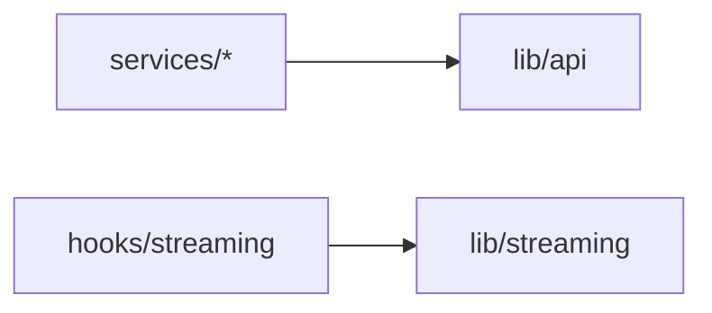

# Lib (`src/lib/`)

## Purpose

**Cross-cutting infrastructure and pure helpers** not tied to a single React feature: HTTP client setup, Firebase config, token storage, routing helpers, role/predicate logic, streaming client, validation, and Tailwind `cn()`. This folder should **not** own feature Redux slices; `api.ts` may dispatch user refresh as an exception for interceptors.

## Key files

| File | Role |
|------|------|
| [`api.ts`](../src/lib/api.ts) | Axios instance, `ApiResponse` typing, auth interceptors, token refresh, optional `store.dispatch` for user refresh |
| [`tokenManager.ts`](../src/lib/tokenManager.ts) | Access token persistence for API layer |
| [`firebase.ts`](../src/lib/firebase.ts) | Firebase app/auth initialization |
| [`routing.ts`](../src/lib/routing.ts) | `getRouteForRole`, `parseOfferingIdParam`; covered by [`tests/lib/routing.test.ts`](../tests/lib/routing.test.ts) |
| [`courseRoleAccess.ts`](../src/lib/courseRoleAccess.ts) | Permission predicates for offerings, tabs, Spark, deploy; [`tests/lib/courseRoleAccess.test.ts`](../tests/lib/courseRoleAccess.test.ts) |
| [`streaming.ts`](../src/lib/streaming.ts) | `createSseStream` helper with consistent auth/options |
| [`semesterUtils.ts`](../src/lib/semesterUtils.ts) | Semester labeling/sorting |
| [`userDisplay.ts`](../src/lib/userDisplay.ts) | Name/email formatting for tables and UI |
| [`validation.ts`](../src/lib/validation.ts) | Input validation helpers (e.g. email) |
| [`utils.ts`](../src/lib/utils.ts) | `cn()` for class merging (Tailwind + `clsx`) |

## Architecture

- **Services** (`src/services`) are the **only** place that should call `api.get/post/...` for domain endpoints; **`lib/api`** is the transport.
- **Hooks** consume **`streaming`** for live deploy/log streams.
- **Components/pages** consume **`routing`**, **`courseRoleAccess`**, and pure utils.

## How to develop here

1. **New HTTP behavior** — extend **`api.ts`** carefully (interceptors affect every request).
2. **New pure rule** — add small focused functions (or a new file if the domain is distinct); prefer unit tests under `tests/lib/`.
3. **Avoid feature imports** — do not import from `pages/` or heavy `components/` from `lib/` (keeps cyclic risk low).

## Common tasks

- **Post-login landing** — update **`getRouteForRole`** when a new default home by role is required.
- **New permission check** — add to **`courseRoleAccess.ts`**, reuse from `CourseLayout` / `CourseNavBar` / pages.

## Related docs

- [services.md](services.md), [hooks.md](hooks.md), [store.md](store.md)
