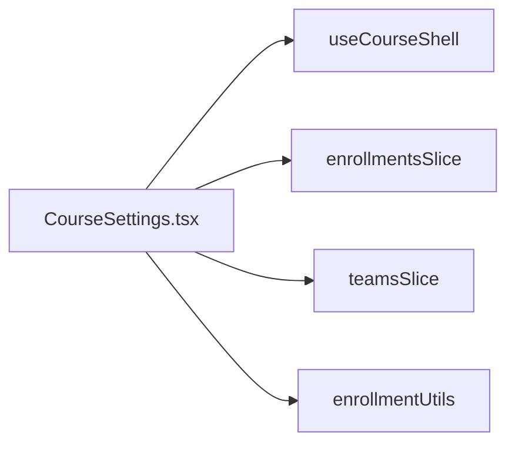

# Course settings module (`src/pages/CourseSettings/`)

## Purpose

**Offering-level administration**: enrollments/roster workflows, teams & tags surface, Spark-adjacent settings as applicable, destructive actions like delete offering — all behind appropriate **role guards** enforced at layout/nav (see **`CourseLayout`**, **`courseRoleAccess`**).

The **`CourseSettings.tsx`** page at **`src/pages/`** root imports helpers from **`CourseSettings/`** when present; colocated utilities keep permission-free transforms testable.

## Key files

| File | Role |
|------|------|
| **[`CourseSettings.tsx`](../src/pages/CourseSettings.tsx)** (parent folder) | Main routed page assembling sections and dispatching thunks (**`enrollmentsThunks`**, **`teamsThunks`**, etc.) |
| [`enrollmentUtils.ts`](../src/pages/CourseSettings/enrollmentUtils.ts) | Pure helpers for roster/group membership normalization — covered by **`tests/pages/CourseSettings/enrollmentUtils.test.ts`** |

## Architecture

Depends on **`useCourseShell()`** ([hooks.md](hooks.md)) for `offeringId` and coherence with **`activeOfferingSlice`**. Heavy read/write crosses **`enrollmentsSlice`**, **`teamsSlice`**, **`courseOfferingsSlice`**, and **`projects`** service helpers used from thunks/UI for tagging workflows.

## How to develop here

1. **Pure transforms** (`enrollmentUtils`) — deterministic I/O-free functions → unit test under **`tests/pages/CourseSettings/`**.
2. **Network effects** — add thunks in **`store/thunks/`**, not inline in JSX.
3. **Guard sensitive actions** — double-check predicates in **`courseRoleAccess`** before exposing destructive buttons.

## Common tasks

- **Adjust roster derivation** — change **`enrollmentUtils`** + extend Vitest suite.

## Related docs

- [pages.md](pages.md), [hooks.md](hooks.md)
- [store-slices.md](store-slices.md), [store-thunks.md](store-thunks.md)
