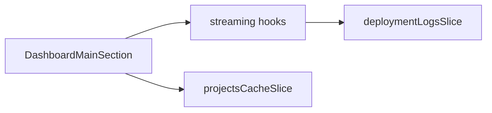

# Dashboard module (`src/pages/Dashboard/`)

## Purpose

**Team-focused deploy tooling**: triggering deploys, watching **streaming build/container logs**, project lists/metadata, sidebar roster context. Shared pieces are reused by:

- **`/dashboard/:teamId`** (**`Dashboard/index.tsx`**) standalone route — no course chrome
- **`/courses/:offeringId/dashboard/:teamId`** — course-scoped team dashboard (**`CourseTeamDashboard`**) composes these sections inside **`CourseLayout`**

Supporting **`shared.tsx`** exports status badges, formatters, and related helpers reused by **`ProjectStatusBadge`** in components.

## Key files

| File | Role |
|------|------|
| [`index.tsx`](../src/pages/Dashboard/index.tsx) | Standalone routed dashboard page (auth-only access at page level) |
| [`DashboardMainSection.tsx`](../src/pages/Dashboard/DashboardMainSection.tsx) | Primary deploy/logs/projects column |
| [`DashboardSideBarSection.tsx`](../src/pages/Dashboard/DashboardSideBarSection.tsx) | Secondary column (team roster/context) |
| [`shared.tsx`](../src/pages/Dashboard/shared.tsx) | Status badge helpers (`getStatusBadge`, etc.) reused outside this folder |

## Architecture

Depends on Redux **`projectsCacheSlice`**, **`teamsSlice`**, and **`deploymentLogsSlice`** paired with **`useStreamingDeploy`**, **`useStreamingBuildLogs`**, **`useStreamingContainerLogs`** ([hooks.md](hooks.md)). Course path variants also read **`activeOffering`** / **`useCourseShell`** for cohesive offering navigation.

Services: **`services.projects`** endpoints for deploy and log parsing helpers.

## How to develop here

1. **Avoid duplicating SSE setup** — extend existing hooks unless the stream semantics differ materially.
2. **Prefer `shared.tsx` helpers** — if a badge/format is needed elsewhere, export from **`shared.tsx`** (or relocate to **`lib/`** if it grows past dashboard concerns).
3. **Loading UX** — surface thunk **loading/error** slices consistently with other pages.

## Common tasks

- **New deploy metric** — likely extend **`projects`** service + thunk in **`projectsCacheThunks`** + UI block in **`DashboardMainSection`**.

## Related docs

- [pages.md](pages.md), [hooks.md](hooks.md)
- [components.md](components.md) (`ProjectStatusBadge` dependency note)
- [store-thunks.md](store-thunks.md)
