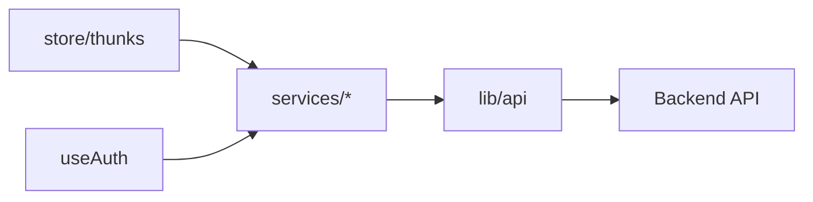

# Services (`src/services/`)

## Purpose

**HTTP boundary** to the backend: thin modules per aggregate (courses, offerings, teams, projects, Spark, admin, …) calling the shared Axios instance from **`@/lib/api`**. **`types.ts`** holds shared entity and DTO types. **No Redux, no hooks** — only async functions and exported objects.

[`index.ts`](../src/services/index.ts) re-exports **types**, **`services`** aggregate object `{ auth, courses, … }`, and **named defaults** (`teamServices`, `projectServices`, etc.).

## Key files

| File | Responsibility |
|------|----------------|
| [`types.ts`](../src/services/types.ts) | Shared TypeScript entities (`User`, `CourseOffering`, `Team`, `Role`, Spark types, CRUD payloads) |
| [`auth.ts`](../src/services/auth.ts) through [`spark.ts`](../src/services/spark.ts), [`admin.ts`](../src/services/admin.ts) | REST wrappers: `api.get/post/patch/delete` returning `Promise<ApiResponse<T>>` (or typed shapes defined in-module) |
| [`projects.ts`](../src/services/projects.ts) | Deploy, logs, tagging — plus helpers like **`parseLogs`** |
| [`dummyData.ts`](../src/services/dummyData.ts) | Fixture data if used locally |
| [`index.ts`](../src/services/index.ts) | Public exports |

## Architecture

Calling **`services` directly from components** is discouraged for new code — prefer **thunks** for caching and consistency (existing code may occasionally call services from modals).

## How to develop here

1. **Extend `types.ts`** — add or extend interfaces for request/response bodies.
2. **Add endpoints** — add methods on the matching `*Services` object (`teamServices.update(...)`).
3. **Export** — confirm `index.ts` exports the module and attaches it to the **`services`** aggregate.
4. **Errors** — let `api` propagate; Redux thunks should map rejection to slice `error` fields.

## Common tasks

- **New backend resource** — new `foo.ts` + aggregate key + thunk layer in **`store/thunks/`** reading from it.

## Related docs

- [store-thunks.md](store-thunks.md), [lib.md](lib.md), [hooks.md](hooks.md)
