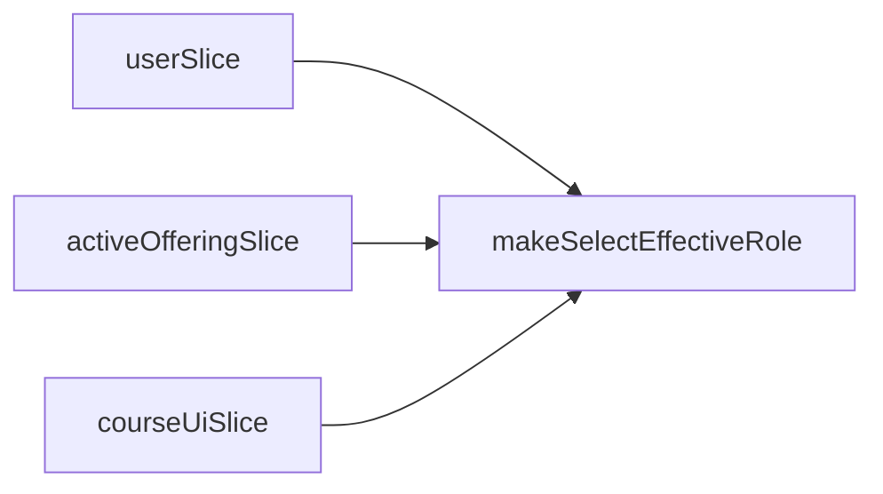

# Store selectors (`src/store/selectors/`)

## Purpose

Memoized (**`createSelector`**) and parameterized reads derived from **`RootState`**, reducing duplication in components/pages. Canonical examples: active offering accessors, curated course lists (`coursesSelectors`), team roster selectors, deployment log accessors, **`userSelectors`** for auth UI.

## Key files

| File | Highlights |
|------|------------|
| [`courseShellSelectors.ts`](../src/store/selectors/courseShellSelectors.ts) | `selectActiveOffering*`, **`makeSelectEffectiveRole(offeringId)`** derives admin/student-vs-admin preview posture, **`selectDashboardTabsForOffering`**, **`selectViewAsStudent`** |
| [`coursesSelectors.ts`](../src/store/selectors/coursesSelectors.ts) | Course catalog derivations |
| [`courseOfferingsSelectors.ts`](../src/store/selectors/courseOfferingsSelectors.ts) | Offering lookups / filters |
| [`semestersSelectors.ts`](../src/store/selectors/semestersSelectors.ts) | Semester ordering helpers |
| [`teamsSelectors.ts`](../src/store/selectors/teamsSelectors.ts) | Team lists/detail maps |
| [`deploymentLogsSelectors.ts`](../src/store/selectors/deploymentLogsSelectors.ts) | Structured log projections |
| [`userSelectors.ts`](../src/store/selectors/userSelectors.ts) | Current user/session reads |

### Effective role (important)

[`makeSelectEffectiveRole`](../src/store/selectors/courseShellSelectors.ts) composes **`userSlice`**, **`activeOffering.offering`**, and **`courseUi.viewAsStudentByOfferingId[offeringId]`**:

- Platform **ADMIN** can preview as **`STUDENT`** when toggle is true
- Otherwise, when **`offering`** matches the URL id, **`offering.userRole`** applies
- Fallback to **`user.role`**

Treat this as **the** source for permission-aligned UI besides raw backend checks still needed for destructive operations.

### Parameterized selectors

Exports like **`makeSelectEffectiveRole(offeringId)`** return a memoized selector instance — ensure call sites memoize **`offeringId`** or stash the memoized selector in `useMemo` when necessary to preserve cache advantages.

## How to develop here

1. **Prefer selectors over inline `state.foo.bar` in JSX** when logic repeats or allocates derived arrays/objects.
2. **Place cross-slice derivation** (`courseShellSelectors`) here—not in **`lib`** (since it depends on Redux state shape).
3. **Unit testing** — colocate **`tests/store/selectors/...`** if logic grows brittle (folder may not exist yet).

## Common tasks

- **New derived list** (`createSelector` input array + projector) referencing multiple slices — add adjacent file grouped by domain.

## Related docs

- [store.md](store.md), [store-slices.md](store-slices.md), [hooks.md](hooks.md)
- [lib.md](lib.md) for **permission predicates** that should remain pure without Redux (`courseRoleAccess`)
