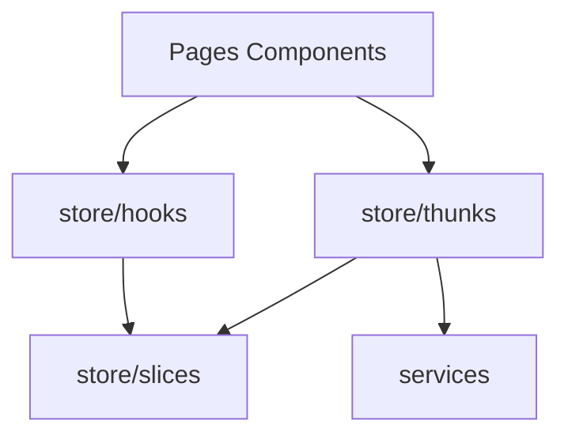

# Store (`src/store/`)

## Purpose

**Redux Toolkit** application store: persisted server-backed lists and maps, active course offering snapshot, UI toggles keyed by offering (view-as-student, dashboard tabs, semester filter on catalog), Spark cache, enrollment cache, deployment log buffers, and the signed-in **`user`**. Async loading uses **`createAsyncThunk`** in **`thunks/`** (not RTK Query). Context-based course/dashboard state has been migrated into slices documented under [store-slices.md](store-slices.md).

## Key files

| File | Role |
|------|------|
| [`index.ts`](../src/store/index.ts) | `configureStore`, reducer registration, `RootState`, `AppDispatch`, exported **`dispatch`** for non-React callers (API interceptors) |
| [`hooks.ts`](../src/store/hooks.ts) | Typed **`useAppDispatch`** / **`useAppSelector`** |

**Subfolders:** [store-slices.md](store-slices.md), [store-thunks.md](store-thunks.md), [store-selectors.md](store-selectors.md).

## Registered slices (snapshot)

Configured in **`store/index.ts`**: **`user`**, **`courses`**, **`courseOfferings`**, **`semesters`**, **`teams`**, **`deploymentLogs`**, **`activeOffering`**, **`courseUi`**, **`dashboardTabs`**, **`coursesUi`**, **`enrollments`**, **`projectsCache`**, **`spark`**.

## Architecture

Pages and components **`dispatch` thunks** and read state via **`useAppSelector`**. Thunks invoke **`services.*`** ([services.md](services.md)). Selectors consolidate derived reads ([store-selectors.md](store-selectors.md)).

## How to develop here

1. **Prefer thunks over component `fetch`** — keeps loading/error centralized.
2. **Keep reducers synchronous** — use Immer via RTK; no async in `reducers`.
3. **Serializable state** — avoid storing non-serializable values (class instances, functions) in slices.
4. **Use selectors** for derived data (effective role, filtered lists) instead of duplicating logic in components.

## Common tasks

- **New server-backed list** — add slice + thunk + selector; register reducer in **`index.ts`**.
- **One-off refresh from interceptor** — use exported **`store.dispatch`** pattern already used for user refresh (see `lib/api.ts`).

## Related docs

- [store-slices.md](store-slices.md), [store-thunks.md](store-thunks.md), [store-selectors.md](store-selectors.md)
- [hooks.md](hooks.md), [services.md](services.md), [lib.md](lib.md)
